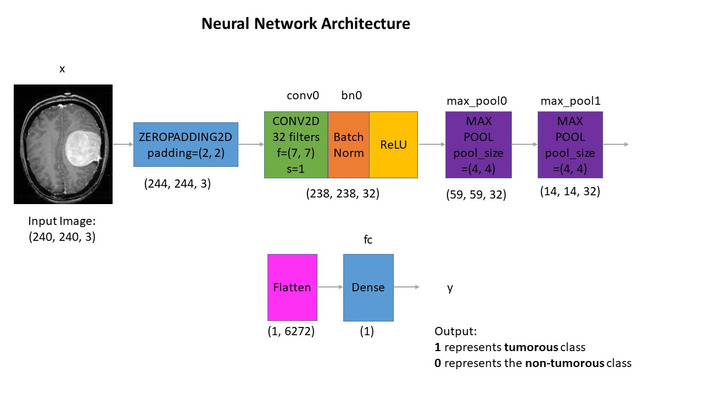
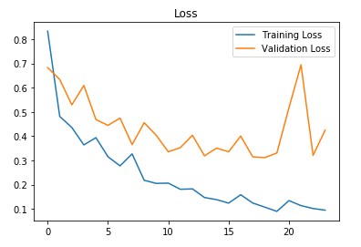
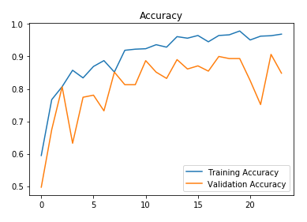

# Brain-Tumor-Detector
Building a detection model using a convolutional neural network in Tensorflow & Keras.<br>
Used a brain MRI images data founded on Kaggle. You can find it [here](https://www.kaggle.com/navoneel/brain-mri-images-for-brain-tumor-detection).<br>

**About the data:**<br>
The dataset contains 2 folders: yes and no which contains 253 Brain MRI Images. The folder yes contains 155 Brain MRI Images that are tumorous and the folder no contains 98 Brain MRI Images that are non-tumorous.

# Getting Started

**Note:** sometimes viewing IPython notebooks using GitHub viewer doesn't work as expected, so you can always view them using [nbviewer](https://nbviewer.jupyter.org/).

## Data Augmentation:

**Why did I use data augmentation?**

Since this is a small dataset, There wasn't enough examples to train the neural network. Also, data augmentation was useful in taclking the data imbalance issue in the data.<br>

Further explanations are found in the Data Augmentation notebook.

Before data augmentation, the dataset consisted of:<br>
155 positive and 98 negative examples, resulting in 253 example images.

After data augmentation, now the dataset consists of:<br>
1085 positive and 980 examples, resulting in 2065 example images.

**Note:** these 2065 examples contains also the 253 original images. They are found in folder named 'augmented data'.

## Data Preprocessing

For every image, the following preprocessing steps were applied:

1. Crop the part of the image that contains only the brain (which is the most important part of the image).
2. Resize the image to have a shape of (240, 240, 3)=(image_width, image_height, number of channels): because images in the dataset come in different sizes. So, all images should have the same shape to feed it as an input to the neural network.
3. Apply normalization: to scale pixel values to the range 0-1.

## Data Split:

The data was split in the following way:
1. 70% of the data for training.
2. 15% of the data for validation.
3. 15% of the data for testing.

# Neural Network Architecture

This is the architecture that I've built:



**Understanding the architecture:**<br>
Each input x (image) has a shape of (240, 240, 3) and is fed into the neural network. And, it goes through the following layers:<br>

1. A Zero Padding layer with a pool size of (2, 2).
2. A convolutional layer with 32 filters, with a filter size of (7, 7) and a stride equal to 1.
3. A batch normalization layer to normalize pixel values to speed up computation.
4. A ReLU activation layer.
5. A Max Pooling layer with f=4 and s=4.
6. A Max Pooling layer with f=4 and s=4, same as before.
7. A flatten layer in order to flatten the 3-dimensional matrix into a one-dimensional vector.
8. A Dense (output unit) fully connected layer with one neuron with a sigmoid activation (since this is a binary classification task).

**Why this architecture?**<br>

Firstly, I applied transfer learning using a ResNet50 and vgg-16, but these models were too complex to the data size and were overfitting. Of course, you may get good results applying transfer learning with these models using data augmentation. But, I'm using training on a computer with 6th generation Intel i7 CPU and 8 GB memory. So, I had to take into consideration computational complexity and memory limitations.<br>

So why not try a simpler architecture and train it from scratch. And it worked :)

# Training the model
The model was trained for 24 epochs and these are the loss & accuracy plots:







The best validation accuracy was achieved on the 23rd iteration.

# Results

Now, the best model (the one with the best validation accuracy) detects brain tumor with:<br>

**88.7%** accuracy on the **test set**.<br>
**0.88** f1 score on the **test set**.<br>
These resutls are very good considering that the data is balanced.

**Performance table of the best model:**

| <!-- -->  | Validation set | Test set |
| --------- | -------------- | -------- |
| Accuracy  | 91%            | 89%      |
| F1 score  | 0.91           | 0.88     |


# Final Notes

What's in the files?

1. The code in the IPython notebooks.
2. The weights for all the models. The best model is named as 'cnn-parameters-improvement-23-0.91.model'.
3. The models are stored as *.model* files. They can be restored as follows:


```
from tensorflow.keras.models import load_model
best_model = load_model(filepath='models/cnn-parameters-improvement-23-0.91.model')
```

4. The original data in the folders named 'yes' and 'no'. And, the augmented data in the folder named 'augmented data'.


Contributes are welcome!
<br>Thank you!


